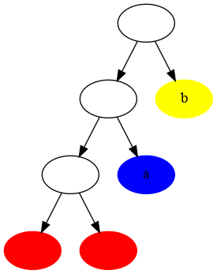
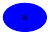
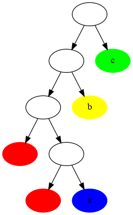
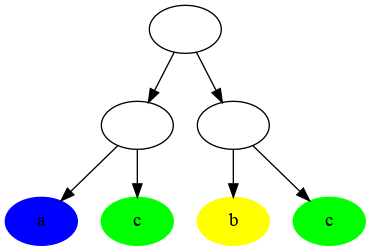
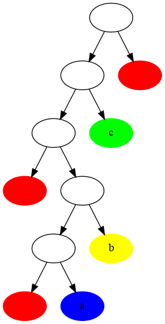
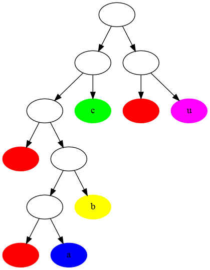
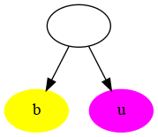
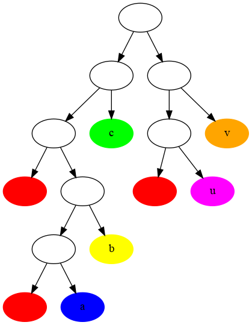
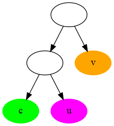

# tree-calculus-visualizer
render the trees corresponding to the rules of tree calculus https://treecalcul.us/

The red node are the leaf (terminal), the white nodes correspond to the internal nodes of the tree, the other colored node correspond to the placeholder for subtrees.

Given a binary tree we pattern match it, and transform it according to the following visual rules : 

Tree calculus computation consist in applying the transforms to the binary tree as much as we can.
A computation in tree calculus is done when we can no longer find a matching pattern.

# Rule 1 :
t t a b -> a

 ->  

# Rule 2 :
t (t a) b c -> a c (b c)

 ->  

# Rule 3 a :
t (t a b) c t -> a

 ->  

# Rule 3 b :
t (t a b) c (t u) -> b u

 ->  

# Rule 3 c :
t (t a b) c (t u v) -> c u v

 ->  


# How it's made :

You need to  ```pip3 install graphviz ``` 
I parsed manually the left associativity to make the parenthesis explicit (to the best of my ability, please excuse any unfortunate mistake).
And I used  ```python3 rendertree.py```  which transform nested tuple into graphviz  graph that are rendered to image.

